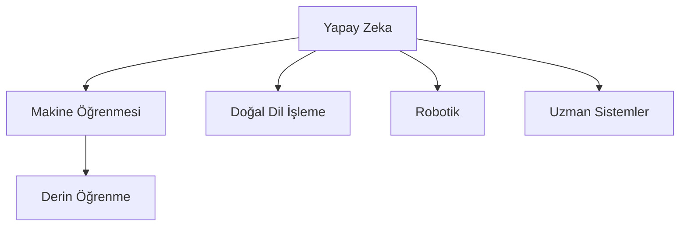

# Yapay Zeka, Makine Öğrenmesi ve Derin Öğrenme: Temel Kavramlar ve Tarihçe

## İçerik
1. [Giriş](#giriş)
2. [Yapay Zeka Nedir?](#yapay-zeka-nedir)
3. [Makine Öğrenmesi](#makine-öğrenmesi)
4. [Derin Öğrenme](#derin-öğrenme)
5. [Tarihsel Gelişim](#tarihsel-gelişim)

## Giriş

Bu döküman, yapay zeka teknolojilerinin temelini oluşturan üç önemli kavramı - Yapay Zeka (AI), Makine Öğrenmesi (ML) ve Derin Öğrenme (DL) - inceleyecektir. Bu kavramların birbirleriyle olan ilişkilerini ve tarihsel gelişimlerini anlayacağız.

### Yapay Zeka Nedir?

Yapay Zeka (AI), insan zekasını taklit eden ve toplanan verilere göre yinelemeli olarak kendini iyileştirebilen sistemlerin geliştirilmesidir. Yapay zeka, aşağıdaki yetenekleri içerir:

- Öğrenme (bilgi edinme ve kuralları kullanma)
- Akıl yürütme (kuralları kullanarak kesin veya yaklaşık sonuçlara ulaşma)
- Kendini düzeltme
- Üretkenlik

### Makine Öğrenmesi

Makine Öğrenmesi, Yapay Zekanın bir alt kümesidir. Sistemlerin deneyimlerden öğrenmesini ve bu öğrenmeleri kullanarak kendini geliştirmesini sağlayan yöntemler bütünüdür.

Temel Makine Öğrenmesi kategorileri:
1. Gözetimli Öğrenme (Supervised Learning)
2. Gözetimsiz Öğrenme (Unsupervised Learning)
3. Pekiştirmeli Öğrenme (Reinforcement Learning)

### Derin Öğrenme

Derin Öğrenme, Makine Öğrenmesinin bir alt kümesidir ve insan beyninin yapısından esinlenen yapay sinir ağlarını kullanır. Temel özellikleri:

- Çok katmanlı yapay sinir ağları kullanması
- Büyük miktarda veriyle eğitim yapabilmesi
- Otomatik özellik çıkarımı yapabilmesi
- Karmaşık örüntüleri öğrenebilmesi

### Yapay Zekanın Alt Alanları

Bu hiyerarşik yapı, bu üç kavramın birbiriyle olan ilişkisini göstermektedir. Derin öğrenme, makine öğrenmesinin bir alt kümesi, makine öğrenmesi de yapay zekanın bir alt kümesidir.

## Tarihsel Gelişim

### 1950'ler
- 1950: Alan Turing'in "Computing Machinery and Intelligence" makalesi
- 1956: Dartmouth Konferansı - "Yapay Zeka" teriminin ortaya çıkışı
- 1959: Cahit Arf'ın "Yapay Zeka" konulu konferansı

### 1960'lar ve 1970'ler
- İlk uzman sistemler
- Perceptron'un geliştirilmesi
- Yapay sinir ağları çalışmalarının başlangıcı

### 1980'ler ve 1990'lar
- Geri yayılım algoritmasının popülerleşmesi
- Makine öğrenmesi algoritmalarının geliştirilmesi

### 2000'ler ve Sonrası
- Büyük veri kavramının ortaya çıkışı
- GPU'ların derin öğrenme için kullanılmaya başlanması
- 2012: AlexNet'in ImageNet yarışmasındaki başarısı
- Derin öğrenme devriminin başlangıcı

## 📚 Önerilen Kaynaklar
- [Machine Learning Crash Course](https://developers.google.com/machine-learning/crash-course)
- [Deep Learning Book](https://www.deeplearningbook.org/)
- [Machine Learning Mastery](https://machinelearningmastery.com/)