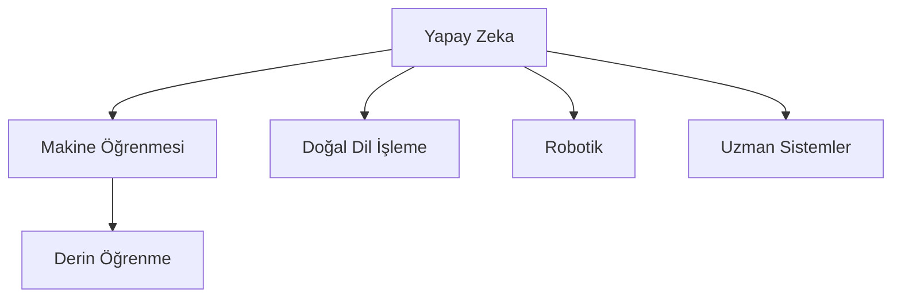

# Yapay Zeka, Makine Öğrenmesi ve Derin Öğrenme

## 🎯 Hedefler
- Yapay zeka, ML ve DL arasındaki farkları anlama
- Temel kavramları ve terminolojiyi öğrenme
- Uygulama alanlarını ve örnekleri kavrama
- Tarihsel gelişimi ve güncel trendleri anlama

## 📑 Ön Koşullar
- Temel matematik bilgisi
- Programlama mantığı
- Problem çözme yeteneği
- Analitik düşünme becerisi

## 🔑 Temel Kavramlar
1. Yapay Zeka (Artificial Intelligence)
2. Makine Öğrenmesi (Machine Learning)
3. Derin Öğrenme (Deep Learning)
4. Veri ve Öğrenme Türleri
5. Model ve Algoritma Kavramları

## Yapay Zeka Nedir?

> Zorluk Seviyesi: 🟢 Başlangıç

> 💡 İpucu: Yapay zeka, insan zekasını taklit eden sistemleri inceleyen geniş bir alandır

Yapay zeka, insan zekasını taklit eden ve öğrenebilen sistemleri inceleyen bilim dalıdır.

### Yapay Zekanın Alt Alanları



### Yapay Zeka Türleri
1. **Dar (Zayıf) AI**: Belirli bir görevi yerine getirmek için tasarlanmış sistemler
   - Satranç oynayan programlar
   - Görüntü sınıflandırma sistemleri
   
2. **Genel (Güçlü) AI**: İnsan gibi düşünebilen ve problem çözebilen sistemler
   - Henüz gerçekleştirilemedi
   - Bilim kurgu filmlerindeki AI sistemleri

## Makine Öğrenmesi Nedir?

Makine Öğrenmesi (ML), yapay zekanın bir alt kümesidir ve verileri kullanarak açıkça programlanmadan öğrenebilen sistemleri ifade eder.

### Makine Öğrenmesi Türleri

1. **Denetimli Öğrenme (Supervised Learning)**
   - Etiketli veri kullanır
   - Örnek: Sınıflandırma, Regresyon
   ```python
   from sklearn.model_selection import train_test_split
   from tensorflow import keras
   
   # Veri setini bölme
   X_train, X_test, y_train, y_test = train_test_split(X, y, test_size=0.2)
   
   # Model oluşturma
   model = keras.Sequential([
       keras.layers.Dense(64, activation='relu', input_shape=(X_train.shape[1],)),
       keras.layers.Dense(1, activation='sigmoid')
   ])
   
   # Model derleme ve eğitim
   model.compile(optimizer='adam', loss='binary_crossentropy', metrics=['accuracy'])
   model.fit(X_train, y_train, epochs=10, validation_data=(X_test, y_test))
   ```

2. **Denetimsiz Öğrenme (Unsupervised Learning)**
   - Etiketsiz veri kullanır
   - Örnek: Kümeleme, Boyut İndirgeme
   ```python
   from sklearn.cluster import KMeans
   import tensorflow as tf
   
   # K-Means kümeleme
   kmeans = KMeans(n_clusters=3)
   kmeans.fit(X)
   
   # Autoencoder ile boyut indirgeme
   autoencoder = keras.Sequential([
       keras.layers.Dense(32, activation='relu', input_shape=(784,)),
       keras.layers.Dense(16, activation='relu'),
       keras.layers.Dense(32, activation='relu'),
       keras.layers.Dense(784, activation='sigmoid')
   ])
   
   autoencoder.compile(optimizer='adam', loss='mse')
   ```

3. **Pekiştirmeli Öğrenme (Reinforcement Learning)**
   ```python
   import tensorflow as tf
   
   class DQNAgent:
       def __init__(self, state_size, action_size):
           self.state_size = state_size
           self.action_size = action_size
           self.model = self._build_model()
   
       def _build_model(self):
           model = keras.Sequential([
               keras.layers.Dense(24, activation='relu', input_shape=(self.state_size,)),
               keras.layers.Dense(24, activation='relu'),
               keras.layers.Dense(self.action_size, activation='linear')
           ])
           model.compile(optimizer=tf.keras.optimizers.Adam(learning_rate=0.001),
                       loss='mse')
           return model
   ```

## Derin Öğrenme Nedir?

Derin öğrenme, makine öğrenmesinin bir alt kümesidir ve çok katmanlı yapay sinir ağlarını kullanır.

### Derin Öğrenmenin Özellikleri

1. **Çok Katmanlı Yapı**
   ```python
   model = keras.Sequential([
       keras.layers.Dense(128, activation='relu'),
       keras.layers.Dense(64, activation='relu'),
       keras.layers.Dense(10, activation='softmax')
   ])
   ```

2. **Otomatik Özellik Çıkarımı**
   ```python
   # CNN ile özellik çıkarımı
   model = keras.Sequential([
       keras.layers.Conv2D(32, (3, 3), activation='relu', input_shape=(28, 28, 1)),
       keras.layers.MaxPooling2D((2, 2)),
       keras.layers.Conv2D(64, (3, 3), activation='relu'),
       keras.layers.Flatten(),
       keras.layers.Dense(10, activation='softmax')
   ])
   ```

### Popüler Derin Öğrenme Modelleri

1. **Evrişimli Sinir Ağları (CNN)**
   ```python
   # Transfer learning ile VGG16
   base_model = keras.applications.VGG16(weights='imagenet', include_top=False)
   x = base_model.output
   x = keras.layers.GlobalAveragePooling2D()(x)
   predictions = keras.layers.Dense(1000, activation='softmax')(x)
   ```

2. **Tekrarlayan Sinir Ağları (RNN)**
   ```python
   # LSTM modeli
   model = keras.Sequential([
       keras.layers.LSTM(64, return_sequences=True, input_shape=(sequence_length, features)),
       keras.layers.LSTM(32),
       keras.layers.Dense(1)
   ])
   ```

3. **Transformers**
   ```python
   # BERT modeli kullanımı
   import tensorflow_hub as hub
   
   bert_layer = hub.KerasLayer("https://tfhub.dev/tensorflow/bert_en_uncased_L-12_H-768_A-12/4",
                              trainable=True)
   ```

## Karşılaştırma

| Özellik | Yapay Zeka | Makine Öğrenmesi | Derin Öğrenme |
|---------|------------|------------------|----------------|
| Kapsam | En geniş | AI'ın alt kümesi | ML'in alt kümesi |
| Veri Gereksinimi | Değişken | Orta | Yüksek |
| Hesaplama Gücü | Değişken | Orta | Yüksek |
| Uygulama Alanları | Genel | Spesifik | Çok spesifik |

## Uygulama Alanları

1. **Görüntü İşleme**
   - Yüz tanıma
   - Medikal görüntü analizi
   - Otonom araçlar

2. **Doğal Dil İşleme**
   - Metin sınıflandırma
   - Makine çevirisi
   - Chatbotlar

3. **Ses İşleme**
   - Konuşma tanıma
   - Müzik üretimi
   - Ses sentezi

## 📚 Önerilen Kaynaklar
- [AI Course by Stanford](https://www.coursera.org/learn/ai)
- [Machine Learning Crash Course](https://developers.google.com/machine-learning/crash-course)
- [Deep Learning Book](https://www.deeplearningbook.org/)

## ✍️ Alıştırmalar
### Başlangıç Seviyesi
1. AI, ML ve DL örneklerini sınıflandırma
2. Temel kavramları açıklama

### Orta Seviye
1. Örnek olay incelemeleri
2. Uygulama alanları analizi

### İleri Seviye
1. Güncel AI trendleri araştırması
2. Etik sorunlar analizi

## Kaynaklar ve İleri Okuma

1. [Deep Learning Book](https://www.deeplearningbook.org/)
2. [Machine Learning Mastery](https://machinelearningmastery.com/)
3. [TensorFlow Tutorials](https://www.tensorflow.org/tutorials)

## Kaynaklar
1. [TensorFlow Documentation](https://www.tensorflow.org/guide)
2. [Machine Learning Mastery](https://machinelearningmastery.com/)
3. [TensorFlow Tutorials](https://www.tensorflow.org/tutorials) 