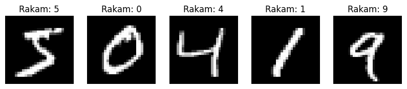
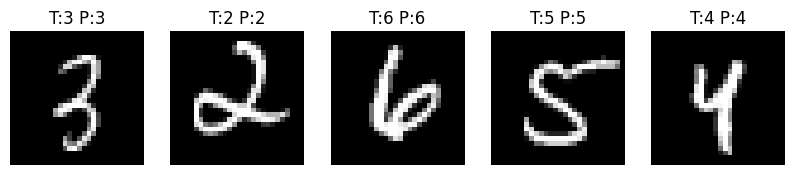

# İlk Derin Öğrenme Modelimiz: MNIST Rakam Sınıflandırma

Bu örnekte, el yazısı rakamları tanıyan basit bir derin öğrenme modeli oluşturacağız. MNIST veri setini kullanarak, 0-9 arasındaki rakamları sınıflandıran bir sinir ağı geliştireceğiz.

## 1. Gerekli Kütüphanelerin İçe Aktarılması

```python
import tensorflow as tf
import numpy as np
import matplotlib.pyplot as plt
```

> [!NOTE]
> TensorFlow, derin öğrenme modelimizi oluşturmak için kullanacağımız ana kütüphane.
> NumPy, veri manipülasyonu için, Matplotlib ise görselleştirme için kullanılacak.

## 2. Veri Setinin Yüklenmesi ve Ön İşleme

```python
# MNIST veri setini yükle
(x_train, y_train), (x_test, y_test) = tf.keras.datasets.mnist.load_data()

# Görüntüleri normalize et (0-1 arasına ölçekle)
x_train = x_train.astype('float32') / 255.0
x_test = x_test.astype('float32') / 255.0

print('Eğitim veri seti boyutu:', x_train.shape)
print('Test veri seti boyutu:', x_test.shape)
```
Eğitim veri seti boyutu: (60000, 28, 28)<br>
Test veri seti boyutu: (10000, 28, 28)

> [!TIP]
> - Veri setini 0-1 arasına ölçekleme (normalizasyon), modelin daha iyi öğrenmesini sağlar
> - MNIST veri seti 60,000 eğitim ve 10,000 test görüntüsü içerir
> - Her görüntü 28x28 piksel boyutundadır

## 3. Veri Görselleştirme

```python
# Rastgele 5 görüntüyü görselleştir
plt.figure(figsize=(10, 2))
for i in range(5):
    plt.subplot(1, 5, i+1)
    plt.imshow(x_train[i], cmap='gray')
    plt.title(f'Rakam: {y_train[i]}')
    plt.axis('off')
plt.show()
```


## 4. Model Mimarisi

```python
model = tf.keras.Sequential([
    # Giriş katmanı - görüntüyü düzleştir
    tf.keras.layers.Flatten(input_shape=(28, 28)),
    
    # Gizli katman 1
    tf.keras.layers.Dense(128, activation='relu'),
    
    # Dropout katmanı - aşırı öğrenmeyi önlemek için
    tf.keras.layers.Dropout(0.2),
    
    # Gizli katman 2
    tf.keras.layers.Dense(64, activation='relu'),
    
    # Çıkış katmanı - 10 sınıf için (0-9 rakamları)
    tf.keras.layers.Dense(10, activation='softmax')
])
```

> [!IMPORTANT]
> Model mimarisinin açıklaması:
> 1. `Flatten`: 28x28 görüntüyü 784 boyutlu bir vektöre dönüştürür
> 2. İlk `Dense` katman: 128 nöronlu gizli katman, ReLU aktivasyonu kullanır
> 3. `Dropout`: Aşırı öğrenmeyi önlemek için nöronların %20'sini rastgele devre dışı bırakır
> 4. İkinci `Dense` katman: 64 nöronlu gizli katman
> 5. Son katman: Her rakam için bir olasılık değeri üreten 10 nöronlu çıkış katmanı

## 5. Model Derleme

```python
model.compile(
    optimizer='adam',
    loss='sparse_categorical_crossentropy',
    metrics=['accuracy']
)

# Model özetini görüntüle
model.summary()
```

Model: "sequential"

| Layer (type)        | Output Shape       | Param #     |
|---------------------|--------------------|-------------|
| flatten (Flatten)   | (None, 784)        | 0           |
| dense (Dense)       | (None, 128)        | 100,480     |
| dropout (Dropout)   | (None, 128)        | 0           |
| dense_1 (Dense)     | (None, 64)         | 8,256       |
| dense_2 (Dense)     | (None, 10)         | 650         |

Total params: 109,386 (427.29 KB)  
Trainable params: 109,386 (427.29 KB)  
Non-trainable params: 0 (0.00 B)

> [!NOTE]
> - `optimizer`: Ağırlıkları güncellemek için Adam optimizasyon algoritması kullanılıyor
> - `loss`: Sınıflandırma problemi için uygun kayıp fonksiyonu
> - `metrics`: Model başarısını ölçmek için doğruluk metriği kullanılıyor

## 6. Model Eğitimi

```python
history = model.fit(
    x_train, y_train,
    epochs=10,
    batch_size=32,
    validation_split=0.2,
    verbose=1
)
```
**Epoch 1/10**  
1500/1500 ━━━━━━━━━━━━━━━━━━━━ 7s 4ms/step - accuracy: 0.8348 - loss: 0.5457 - val_accuracy: 0.9567 - val_loss: 0.1442  
**Epoch 2/10**  
1500/1500 ━━━━━━━━━━━━━━━━━━━━ 6s 4ms/step - accuracy: 0.9537 - loss: 0.1485 - val_accuracy: 0.9690 - val_loss: 0.1017  
**Epoch 3/10**  
1500/1500 ━━━━━━━━━━━━━━━━━━━━ 6s 4ms/step - accuracy: 0.9675 - loss: 0.1072 - val_accuracy: 0.9668 - val_loss: 0.1099  
**Epoch 4/10**  
1500/1500 ━━━━━━━━━━━━━━━━━━━━ 5s 3ms/step - accuracy: 0.9712 - loss: 0.0898 - val_accuracy: 0.9711 - val_loss: 0.1006  
**Epoch 5/10**  
1500/1500 ━━━━━━━━━━━━━━━━━━━━ 5s 3ms/step - accuracy: 0.9763 - loss: 0.0733 - val_accuracy: 0.9754 - val_loss: 0.0866  
**Epoch 6/10**  
1500/1500 ━━━━━━━━━━━━━━━━━━━━ 6s 4ms/step - accuracy: 0.9790 - loss: 0.0650 - val_accuracy: 0.9754 - val_loss: 0.0891  
**Epoch 7/10**  
1500/1500 ━━━━━━━━━━━━━━━━━━━━ 6s 4ms/step - accuracy: 0.9812 - loss: 0.0569 - val_accuracy: 0.9774 - val_loss: 0.0862  
**Epoch 8/10**  
1500/1500 ━━━━━━━━━━━━━━━━━━━━ 6s 4ms/step - accuracy: 0.9826 - loss: 0.0522 - val_accuracy: 0.9756 - val_loss: 0.0858  
**Epoch 9/10**  
1500/1500 ━━━━━━━━━━━━━━━━━━━━ 7s 5ms/step - accuracy: 0.9820 - loss: 0.0541 - val_accuracy: 0.9749 - val_loss: 0.0900  
**Epoch 10/10**  
1500/1500 ━━━━━━━━━━━━━━━━━━━━ 6s 4ms/step - accuracy: 0.9859 - loss: 0.0455 - val_accuracy: 0.9774 - val_loss: 0.0889
> [!TIP]
> Eğitim parametreleri:
> - `epochs`: Veri seti üzerinden 10 kez geçilecek
> - `batch_size`: Her seferde 32 görüntü işlenecek
> - `validation_split`: Eğitim verisinin %20'si doğrulama için ayrılacak

## 7. Eğitim Sonuçlarının Görselleştirilmesi

```python
plt.figure(figsize=(12, 4))

# Doğruluk grafiği
plt.subplot(1, 2, 1)
plt.plot(history.history['accuracy'], label='Eğitim Doğruluğu')
plt.plot(history.history['val_accuracy'], label='Doğrulama Doğruluğu')
plt.title('Model Doğruluğu')
plt.xlabel('Epoch')
plt.ylabel('Doğruluk')
plt.legend()

# Kayıp grafiği
plt.subplot(1, 2, 2)
plt.plot(history.history['loss'], label='Eğitim Kaybı')
plt.plot(history.history['val_loss'], label='Doğrulama Kaybı')
plt.title('Model Kaybı')
plt.xlabel('Epoch')
plt.ylabel('Kayıp')
plt.legend()

plt.show()
```


## 8. Test Veri Seti Üzerinde Değerlendirme

```python
test_loss, test_accuracy = model.evaluate(x_test, y_test, verbose=0)
print(f'\nTest Doğruluğu: {test_accuracy:.4f}')
```

## 9. Tahmin Örneği

```python
# Test setinden rastgele 5 görüntü seç ve tahmin yap
test_images = x_test[:5]
predictions = model.predict(test_images)

plt.figure(figsize=(10, 2))
for i in range(5):
    plt.subplot(1, 5, i+1)
    plt.imshow(test_images[i], cmap='gray')
    pred_label = np.argmax(predictions[i])
    true_label = y_test[i]
    plt.title(f'T:{true_label} P:{pred_label}')
    plt.axis('off')
plt.show()
```



## 📚 Önerilen Kaynaklar
- [TensorFlow MNIST Tutorial](https://www.tensorflow.org/tutorials/quickstart/beginner)
- [Deep Learning with Python](https://www.manning.com/books/deep-learning-with-python)
- [Hands-On Machine Learning with Scikit-Learn, Keras, and TensorFlow](https://www.oreilly.com/library/view/hands-on-machine-learning/9781492032632/)
