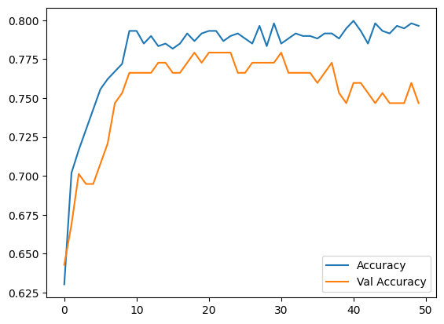

# Derin Öğrenme ile Sınıflandırma

Bu örnekte yapay sinir ağı ile Sınıflandırma modeli geliştireceğiz.

> Projede kullanılacak verileri [buradan](../Data/pima-indians-diabetes.csv) indirebilirsiniz.


**Veri Yükleme:**
- pandas kütüphanesi veri analizi için Python'ın en önemli araçlarından biridir
- `read_csv()` fonksiyonu ile CSV formatındaki veri setimizi okuyoruz
- `head()` fonksiyonu ile ilk 5 satırı görüntülüyoruz
- Bu veri seti, Pima Yerlileri'nde diyabet hastalığının teşhisi için kullanılan özellikleri içerir

```python
import pandas as pd

df = pd.read_csv("pima-indians-diabetes.csv")
df.head()
```

|   | Pregnancies | Glucose | BloodPressure | SkinThickness | Insulin |  BMI | DiabetesPedigreeFunction | Age | Outcome |
|--:|------------:|---------:|---------------:|--------------:|---------:|-----:|------------------------:|----:|---------:|
| **0** |           6 |      148 |            72 |            35 |        0 | 33.6 |                  0.627 |   50 |        1 |
| **1** |           1 |       85 |            66 |            29 |        0 | 26.6 |                  0.351 |   31 |        0 |
| **2** |           8 |      183 |            64 |             0 |        0 | 23.3 |                  0.672 |   32 |        1 |
| **3** |           1 |       89 |            66 |            23 |       94 | 28.1 |                  0.167 |   21 |        0 |
| **4** |           0 |      137 |            40 |            35 |      168 | 43.1 |                  2.288 |   33 |        1 |


**Veri Ön İşleme:**
- Veriyi bağımlı (y) ve bağımsız (x) değişkenler olarak ayırıyoruz
- `drop()` fonksiyonu ile "Outcome" sütununu x'ten çıkarıyoruz
- `scale()` fonksiyonu ile verileri standartlaştırıyoruz (ortalama=0, standart sapma=1)
- Standartlaştırma, modelin daha iyi öğrenmesini sağlar

```python
x = df.drop("Outcome", axis=1)
y = df[["Outcome"]]
```

```python
from sklearn.preprocessing import scale, normalize
x = scale(x)
```

```python
import tensorflow as tf
from tensorflow.keras.models import Sequential
from tensorflow.keras.layers import Dense
```
**Model Oluşturma:**
- TensorFlow, derin öğrenme için kullanılan güçlü bir kütüphanedir
- Sequential model, katmanların sıralı bir şekilde eklendiği en basit model tipidir
- Model mimarisi:
  - İlk katman: 12 nöron, ReLU aktivasyon fonksiyonu
  - Gizli katman: 8 nöron, ReLU aktivasyon fonksiyonu
  - Çıkış katmanı: 1 nöron, Sigmoid aktivasyon fonksiyonu (0-1 arası çıktı için)

```python
model = Sequential()
model.add(Dense(12, activation="relu"))
model.add(Dense(8, activation="relu"))
model.add(Dense(1, activation="sigmoid"))
```

**Model Eğitimi:**
- `compile()` fonksiyonu ile model yapılandırması:
  - loss: İkili sınıflandırma için binary_crossentropy
  - optimizer: Adam optimizasyon algoritması
  - metrics: Doğruluk oranı takibi
- `fit()` fonksiyonu ile model eğitimi:
  - epochs=50: Veri seti üzerinden 50 kez geçiş
  - batch_size=10: Her seferde 10 örnek işleme
  - validation_split=.2: Verinin %20'si doğrulama için ayrılıyor

```python
model.compile(loss="binary_crossentropy", 
             optimizer="adam", 
             metrics=["accuracy"])

history = model.fit(x, y, epochs=50, batch_size=10, 
                   validation_split=.2, verbose=1)
```

Epoch 1/50 <br>
**62/62** <code style="color:green">━━━━━━━━━━━━━━━━━━━━</code> **3s** 13ms/step - accuracy: 0.6650 - loss: 0.6353 - val_accuracy: 0.6818 - val_loss: 0.6167<br>
Epoch 2/50 <br>
**62/62** <code style="color:green">━━━━━━━━━━━━━━━━━━━━</code> **1s** 9ms/step - accuracy: 0.6811 - loss: 0.6078 - val_accuracy: 0.6883 - val_loss: 0.5790<br>
Epoch 3/50 <br>
**62/62** <code style="color:green">━━━━━━━━━━━━━━━━━━━━</code> **1s** 8ms/step - accuracy: 0.6987 - loss: 0.5694 - val_accuracy: 0.7208 - val_loss: 0.5545<br>
...<br>
Epoch 49/50 <br>
**62/62** <code style="color:green">━━━━━━━━━━━━━━━━━━━━</code> **1s** 7ms/step - accuracy: 0.8254 - loss: 0.3963 - val_accuracy: 0.7597 - val_loss: 0.4932<br>
Epoch 50/50 <br>
**62/62** <code style="color:green">━━━━━━━━━━━━━━━━━━━━</code> **0s** 7ms/step - accuracy: 0.7986 - loss: 0.4442 - val_accuracy: 0.7597 - val_loss: 0.4916

**Model Değerlendirme ve Tahmin**
- `evaluate()` fonksiyonu ile modelin performansını ölçüyoruz
- Loss değeri modelin hata oranını gösterir
- Accuracy değeri modelin doğruluk oranını gösterir
- `predict()` fonksiyonu ile yeni tahminler yapabiliriz
- Çıktı 0-1 arasında olasılık değerleridir (0: Diyabet değil, 1: Diyabet)

```python
print("\nModel Değerlendirme:")
loss, accuracy = model.evaluate(x, y)
print(f"Loss: {loss:.4f}")
print(f"Accuracy: {accuracy:.4f}")

predictions = model.predict(x)
print("\nÖrnek Tahminler:")
print(predictions[:5])
```
Model Değerlendirme: <br>
**24/24** <code style="color:green">━━━━━━━━━━━━━━━━━━━━</code> **0s** 8ms/step - accuracy: 0.7806 - loss: 0.4507<br>
Loss: 0.4257<br>
Accuracy: 0.7982<br>
**24/24** <code style="color:green">━━━━━━━━━━━━━━━━━━━━</code> **0s** 3ms/step  <br>


Örnek Tahminler:<br>
[[0.73089784]<br>
 [0.04118663]<br>
 [0.8711563 ]<br>
 [0.01699266]<br>
 [0.95399505]]<br>

**Modelin Başarı Grafiği**

Modelin eğitim ve kayıp verilerini bir grafikle inceleyelim.

```python
import matplotlib.pyplot as plt

plt.plot(history.history["accuracy"], label="Accuracy")
plt.plot(history.history["val_accuracy"], label="Val Accuracy")
plt.legend()
```


## Sonuç

Geliştirdiğimiz derin öğrenme modeli, Pima Yerlileri diyabet veri setinde yaklaşık %80 doğruluk oranına ulaşmıştır. Bu, sağlık alanında makul bir başarı oranıdır, ancak iyileştirme yapılabilir.

Model performansını artırmak için:
- Veri seti genişletilebilir veya veri artırma teknikleri kullanılabilir
- Hiperparametre optimizasyonu yapılabilir (örn: katman sayısı, nöron sayısı)
- Veri önişleme adımları geliştirilebilir (örn: aykırı değer analizi)
