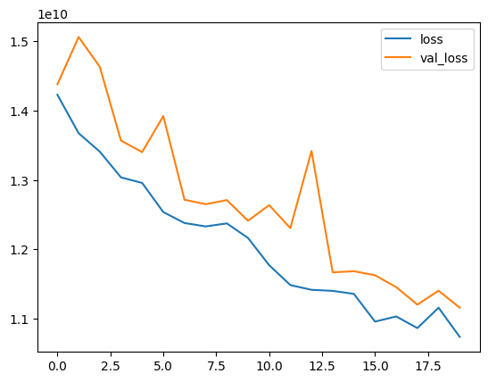

# Derin Öğrenme ile Regresyon
Bu örnekte yapay sinir ağı ile ev fiyatları üzerinde regresyon modeli geliştireceğiz. Amacımız, evin özelliklerine bakarak fiyat tahmini yapmak.

> Projede kullanılacak verileri [buradan](../Data/kc_house.pkl) indirebilirsiniz.

### 1. Veri Setinin Yüklenmesi ve İncelenmesi

Öncelikle gerekli kütüphaneyi import edip veri setimizi yükleyelim:

```python
import pandas as pd

df=pd.read_pickle("kc_house.pkl")
df.head()
```

Veri setimiz şu şekilde görünüyor:

||bedrooms|bathrooms|sqft_living|grade|view|basement|waterfront|floors|age|renovated|...|
|:---:|--:|------:|----:|--:|--:|--:|--:|---:|--:|--:|:-:|
|**0**|	9|	1.0000|	1180|	7|	0|	0|	0|	1.0|	65|	0|	...|	
|**1**| 9| 5.0625| 2570| 7| 0| 1| 0| 2.0| 69| 1|...|
|**2**| 4| 1.0000|  770| 6| 0| 0| 0| 1.0| 87| 0|...|
|**3**|16| 9.0000| 1960| 7| 0| 1| 0| 1.0| 55| 0|...|
|**4**| 9| 4.0000| 1680| 8| 0| 0| 0| 1.0| 33| 0|...|

5 rows × 82 columns

### 2. Veri Setinin Hazırlanması

Bağımlı ve bağımsız değişkenleri ayıralım:

```python
x = df.drop("price", axis=1)  # Bağımsız değişkenler
y = df[["price"]]            # Bağımlı değişken (hedef)
```

### 3. Eğitim ve Test Verilerinin Ayrılması

Veri setimizi eğitim ve test olarak ayırıyoruz:

```python
from sklearn.model_selection import train_test_split
x_train, x_test, y_train, y_test = train_test_split(x, y, test_size=.2, random_state=42)
```
```python
import tensorflow as tf
from tensorflow.keras.models import Sequential
from tensorflow.keras.layers import Dense
```

### 4. Model Oluşturma

Sequential API kullanarak modelimizi oluşturuyoruz:

```python
model = Sequential()
model.add(Dense(12, activation="relu"))  # İlk gizli katman
model.add(Dense(8, activation="relu"))   # İkinci gizli katman
model.add(Dense(1))                      # Çıkış katmanı
```

### 5. Model Derleme ve Eğitim

Modelimizi derleyip eğitiyoruz:

```python
model.compile(loss="mse", optimizer="adam")

history = model.fit(x_train, y_train, 
                    validation_data=(x_test, y_test),
                    epochs=20, batch_size=64, verbose=1)
```
Epoch 1/20<br>
**238/238** <span style="color:green">━━━━━━━━━━━━━━━━━━━━</span> **7s** 14ms/step - loss: 14684349440.0000 - val_loss: 14378359808.0000<br>
Epoch 2/20<br>
**238/238** <span style="color:green">━━━━━━━━━━━━━━━━━━━━</span> **1s** 4ms/step - loss: 13463132160.0000 - val_loss: 15057628160.0000<br>
Epoch 3/20<br>
**238/238** <span style="color:green">━━━━━━━━━━━━━━━━━━━━</span> **1s** 3ms/step - loss: 14003663872.0000 - val_loss: 14628977664.0000<br>
...<br>
Epoch 19/20<br>
**238/238** <span style="color:green">━━━━━━━━━━━━━━━━━━━━</span> **1s** 4ms/step - loss: 11650306048.0000 - val_loss: 11404175360.0000<br>
Epoch 20/20<br>
**238/238** <span style="color:green">━━━━━━━━━━━━━━━━━━━━</span> **1s** 4ms/step - loss: 10592477184.0000 - val_loss: 11160828928.0000

### 6. Tahmin ve Model Değerlendirme

Test verileri üzerinde tahmin yapıp, modeli değerlendirelim:

```python
tahmin = model.predict(x_test)
```
**119/119** <span style="color:green">━━━━━━━━━━━━━━━━━━━━</span> **1s** 5ms/step

```python
from sklearn.metrics import r2_score, mean_squared_error

# R-kare skoru
print("R2 Score:", r2_score(y_test, tahmin))

# RMSE değeri
print("RMSE:", mean_squared_error(y_test, tahmin) ** .5)
```
R2 Score: 0.7819754661423687<br>
RMSE: 105644.82569062279
### 7. Eğitim Sürecinin Görselleştirilmesi

Eğitim sürecindeki loss değerlerinin grafiğini çizelim:

```python
loss_f = pd.DataFrame(history.history)
loss_f.plot()
```



### 8. Sonuç ve İyileştirme Önerileri

Regresyon modelimiz ev fiyatları tahmininde kullanılabilir seviyede sonuçlar üretmiştir. Modelin performansını artırmak için şu adımlar uygulanabilir:

1. **Veri Ön İşleme:**
    - Aykırı değerlerin temizlenmesi
    - Özelliklerin normalize edilmesi
    - Eksik verilerin daha etkin yönetimi

2. **Model Mimarisi:**
    - Daha fazla gizli katman eklenmesi
    - Dropout katmanları ile overfitting'in önlenmesi
    - Farklı aktivasyon fonksiyonlarının denenmesi

3. **Hiperparametreler:**
    - Learning rate optimizasyonu
    - Batch size değerinin ayarlanması
    - Farklı optimizasyon algoritmalarının denenmesi

4. **Cross-validation** tekniğinin uygulanması ile modelin genelleme yeteneğinin artırılması

Bu iyileştirmeler uygulanarak model performansı önemli ölçüde artırılabilir.