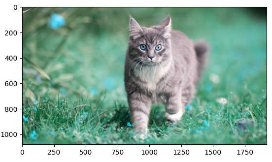
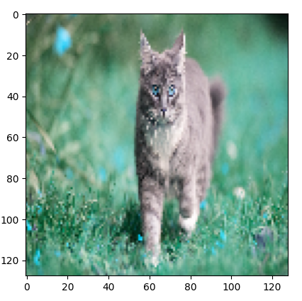
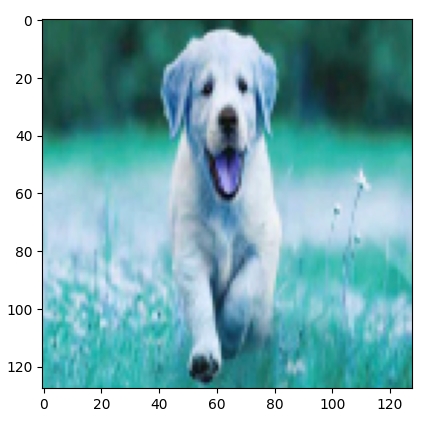

# Kedi ve Köpek Resim Sınıflandırma

Resim sınıflandırma projelerinde kullanılan yöntemlerden birisi; her bir sınıfa ait resimlerin ayrı ayrı klasörlerde tutularak okunması ve modelin eğitilmesidir. Bu projede resimler `dataset` isimli klasörün içinde her bir resim sınıfı için açılan alt klasörler olan `cat` ve `dog` klasörlerinde bulundurulmaktadır.


[Resim Kaynağı](https://encrypted-tbn0.gstatic.com/images?q=tbn:ANd9GcR8hcDIg__b6TC3VSyZqFqNtGFHQmvuQJFUow&s)

## Hazırlık

1. Öncelikle gerekli kütüphaneleri ekleyelim.

```py
import cv2
import pandas as pd
import numpy as np
import os
import matplotlib.pyplot as plt
from sklearn.model_selection import train_test_split
```

2. Resimlerin bulunduğu ana klasörü ve sınıf isimlerini barındıran listeyi oluşturalım.

```py
img_path = "dataset/"
labels = ["cat", "dog"]
```
## Resimleri Okuma
1. Resimlerin yolu ve sınıf isimlerinden oluşan bir data frame oluşturalım.
```py
img_list = []
label_list = []
for label in labels:
    for img_file in os.listdir(img_path+label):
        img_list.append(img_path+label+"/"+img_file)
        label_list.append(label)

df = pd.DataFrame({"img":img_list, "label":label_list})
```
2. Oluşturduğumuz data frame için yeni bir alana sınıfları temsil eden sayılar ekleyelim.

```py
d = {"cat":0, "dog":1}
df["encode_label"]= df["label"].map(d)
```
3. Eğitim sırasında problem çıkarmaması için listeyi karıştıralım.
```py
df = df.sample(frac=1)
df = df.reset_index(drop=True)
```
## Resim Ön-işleme

1. İlk resmimizi bir görelim.

```py
image = cv2.imread(str(df["img"][0]))
plt.imshow(image)
```


2. Tüm resimleri tek tek okuyarak yeniden boyutlandırma ve normalizasyon işlemi yapalım. Bu aşamada modelin girdi verileri olan `x` değişkenini de oluşturmuş oluyoruz.

```py
size=128
x=[]
for imge in df["img"]:
    img = cv2.imread(str(imge))
    # print(imge)
    img = cv2.resize(img, (size,size))
    img = img/255.0 
    x.append(img)
```
> [!WARNING]
> Klasörde okunabilen resim formatları dışında dosya varsa bu aşamada hata ile karşılaşılabilir. Hangi resmin hata verdiğini görebilmek için `print(image)` satırı açılarak kodu tekrar çalıştırın. Hata veren dosya listenin en altındaki dosyadır. Klasörde silme işlemi yaptıysanız [Resimleri Okuma](#resimleri-okuma) işlemine geri dönerek kodları tekrar çalıştırınız.

3. Ön-işlemden geçmiş resmin son hali.
```py
plt.imshow(x[0])
```


## Modelleme

1. Modelin girdi verilerini diziye dönüştürüp modelin çıktı verisi olan 'y' değişkenini oluşturalım.

```py
x = np.array(x)
y = df['encode_label']
```
2. Verileri eğitim ve test olmak üzere parçalayalım.

```py
x_train,x_test,y_train,y_test=train_test_split(x,y,test_size=.2,random_state=42)
```
3. Derin öğrenme modeli için gerekli kütüphaneler.

```py
import tensorflow as tf
from keras.models import Sequential
from keras.layers import Conv2D, Dense, Flatten, MaxPooling2D
```
4. Modeli oluşturalım ve derleyelim.
```py
model = Sequential()
model.add(Conv2D(32, (3, 3), activation='relu', input_shape=(size, size, 3)))
model.add(MaxPooling2D(pool_size=(2,2)))
model.add(Conv2D(64,kernel_size=(3,3),activation='relu'))
model.add(MaxPooling2D(pool_size=(2,2)))
model.add(Conv2D(128,kernel_size=(3,3),activation='relu'))
model.add(Flatten())
model.add(Dense(128))
model.add(Dense(1, activation='sigmoid'))

model.compile(optimizer='adam', loss='binary_crossentropy', metrics=['accuracy'])
```
5. Modeli eğitelim.

```py
history = model.fit(x_train,y_train, validation_data=(x_test,y_test), epochs=100, verbose=1)
```
6. Test verileri ile modeli test edelim.
```py
tahmin = model.predict(x_test[0:1])
print("İlk resmin etiketi:", y_test[0:1])
print("Modelin tahmini:", tahmin)
print("Sınıf etiketleri:", labels)
print("Tahmin edilen sınıf:", labels[int(np.round(tahmin[0][0]))])
```
1/1 ━━━━━━━━━━━━━━━━━━━━ 0s 29ms/step <br>
İlk resmin etiketi: 193    **1** <br>
Name: encode_label, dtype: **int64** <br>
Modelin tahmini: [[**0.9999249**]] <br>
Sınıf etiketleri: ['cat', 'dog'] <br>
Tahmin edilen sınıf: **dog**

7. Tahmin edilen resmi görelim.

```py
plt.imshow(x_test[0])
```



## Sonuç
Bu projede, kedi ve köpek resimlerini sınıflandırmak için bir derin öğrenme modeli geliştirilmiştir. Model, resimlerin ön-işleme aşamasından geçirilmesiyle oluşturulan eğitim ve test verileri üzerinde eğitilmiş ve test edilmiştir. Sonuç olarak, model test verileri üzerinde başarılı tahminler yapmıştır. Bu süreç, resim sınıflandırma problemlerinde derin öğrenme modellerinin etkinliğini göstermektedir. Ayrıca, modelin performansı artırılabilir ve farklı veri kümeleriyle genişletilerek daha genel bir sınıflandırma sistemi oluşturulabilir.

## Bonus

İnternetten resim indirmek için `bing_image_downloader` kütüphanesi kullanılabilir. Öncelikle bu paketi kurmak gerekebilir.

```py
pip install bing-image-downloader
```

Gerekli kütüphaneyi ekleyip resimleri indirelim.
```py
from bing_image_downloader import downloader
aranan_ifade = "dog"
downloader.download(aranan_ifade, limit=300)
```
Bu kod ile `aranan_ifade` değişkeni ile belirlenen ifade kullanılarak internette arama yapılır, önce `dataset` isminde bir klasör açılır ve bulunan resimler yine aynı isimle açılan alt klasöre indirilir. İndirilecek resim sayısı `limit` parametresi ile belirlenir. Bu projede kullanılan resimler bu yöntemle indirilmiştir.

> [!WARNING]
> İndirilen resimler her zaman konu ile alakalı olmayabilir. Klasördeki resimler incelenerek farklı formatlarda indirilenler veya bozuk olanlar silinmelidir. Aksi halde, metin ön işleme adımında hata ile karşılaşılabilir.